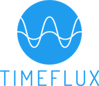

# Timeflux

[2023 International BCI meeting](https://bcisociety.org/bci-meeting/)

Workshop W5 Session 1 - Wednesday, June 7, 9:30am – 12:30pm (Sonian Forest Time)

## Resources

- Timeflux [website](https://timeflux.io) and [code](https://github.com/timeflux/).
- Open-source [demos](https://github.com/timeflux/demos).

## References

- P. Clisson, R. Bertrand-Lalo, M. Congedo, G. Victor-Thomas, J. Chatel-Goldman: "Timeflux: an open-source framework for the acquisition and near real-time processing of signal streams".
- Q. Barthélémy, S. Checallier, R. Bertrand-Lalo, P. Clisson: "End-to-end P300 BCI using Bayesian accumulation of Riemannian probabilities".
